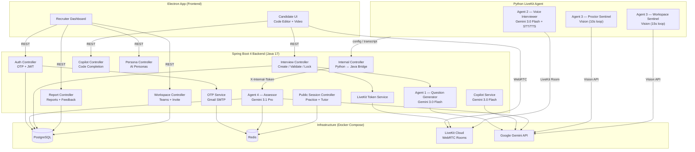

# Owlyn — AI-Powered Technical Interview Platform

[](LICENSE)

Owlyn is a multi-agent AI platform that conducts live technical interviews, proctors candidates via webcam, provides real-time code assistance, and generates structured evaluation reports — all autonomously.

Built with **Spring Boot 4 (Java 17)** + a **Python LiveKit voice agent** + **Google Gemini**.

---

## Architecture



### Four AI Agents

| Agent | Runtime | Model | Role |
|-------|---------|-------|------|
| **Agent 1** — Question Generator | Java | Gemini 3.0 Flash | Drafts interview questions from job title |
| **Agent 2** — Voice Interviewer | Python | Gemini 3.0 Flash + Google STT/TTS | Conducts live voice interview via LiveKit |
| **Agent 3** — Sentinels | Python | Gemini 3.0 Flash (Vision) | Proctor (phone/gaze detection every 10s) + Workspace (code bug detection every 15s) |
| **Agent 4** — Assessor | Java | Gemini 3.1 Pro | Generates structured JSON evaluation report from transcript |

### Two Modes

- **B2B (Enterprise):** Recruiters create interviews with 6-digit access codes. Candidates join via kiosk-locked Electron app. Reports saved to PostgreSQL.
- **B2C (Public):** Practice Mode (mock FAANG interviews) and Tutor Mode (desktop screen-share AI helper). Ephemeral reports stored in Redis (15min TTL).

---

## Tech Stack

| Layer | Technology |
|-------|------------|
| Backend | Java 17, Spring Boot 4.0.3, Spring Security, Spring Data JPA |
| AI Agent | Python 3.13+, LiveKit Agents SDK 1.4.4 |
| AI Models | Google Gemini 3.0 Flash, Gemini 3.1 Pro |
| Real-time | LiveKit Cloud (WebRTC) |
| Database | PostgreSQL |
| Cache | Redis (OTP, ephemeral reports) |
| Auth | JWT (HMAC-SHA256) + Email OTP |
| Resilience | Resilience4j (Circuit Breaker + Retry) |
| Doc Parsing | Apache Tika (PDF/DOCX) |
| Build | Maven (Java), uv (Python) |

---

## Project Structure

```
OwlynBackend/
├── src/main/java/com/owlynbackend/
│   ├── config/
│   │   ├── security/          # JWT filter, SecurityConfig, UserDetailsService
│   │   ├── logging/           # AOP execution time logging
│   │   ├── GeminiConfig.java  # Google GenAI client bean
│   │   ├── AsyncConfig.java   # @EnableAsync for Agent 4
│   │   └── GeneralConfig.java # Redis serializer config
│   ├── controller/
│   │   ├── AuthController.java          # POST /api/auth/signup|login|verify-*|me
│   │   ├── InterviewController.java     # POST|GET /api/interviews/*
│   │   ├── WorkspaceController.java     # GET|PUT|POST|DELETE /api/workspace/*
│   │   ├── ReportController.java        # GET|POST /api/reports/*
│   │   ├── CopilotController.java       # POST /api/copilot
│   │   ├── AIPersonaController.java     # GET|POST|DELETE /api/personas/*
│   │   ├── PublicSessionController.java # POST /api/public/sessions/*
│   │   ├── PublicReportController.java  # GET /api/public/reports/*
│   │   └── InternalReportController.java# Python↔Java bridge (X-Internal-Token)
│   ├── services/              # Business logic for each domain
│   └── internal/
│       ├── model/             # JPA entities (User, Workspace, Interview, etc.)
│       ├── dto/               # Request/Response DTOs
│       ├── repository/        # Spring Data JPA repositories
│       └── errors/            # 12 custom exception classes
├── src/main/resources/
│   └── application.properties.example   # Template config (copy & fill secrets)
├── interviewAgent/
│   ├── main.py                # LiveKit voice agent (Agents 2 & 3)
│   ├── .env.example           # Template env vars (copy & fill secrets)
│   └── pyproject.toml         # Python dependencies (uv)
├── compose.yaml               # PostgreSQL + Redis
├── pom.xml                    # Maven dependencies
└── LICENSE                    # MIT
```

---

## Prerequisites

- **Java 17+**
- **Maven 3.9+**
- **Python 3.13+** with [uv](https://docs.astral.sh/uv/)
- **Docker** (for PostgreSQL + Redis)
- **Google Cloud** account with [Gemini API key](https://aistudio.google.com/apikey)
- **LiveKit Cloud** account ([livekit.io](https://livekit.io)) — get API key + secret
- **Gmail App Password** for OTP emails ([guide](https://support.google.com/accounts/answer/185833))

---

## Quick Start

### 1. Clone

```bash
git clone https://github.com/YOUR_USERNAME/OwlynBackend.git
cd OwlynBackend
```

### 2. Start PostgreSQL & Redis

```bash
docker compose up -d
```

### 3. Configure Spring Boot

```bash
cp src/main/resources/application.properties.example src/main/resources/application.properties
```

Edit `src/main/resources/application.properties` and fill in your secrets:

| Property | Description |
|----------|-------------|
| `jwt.secret` | Base64-encoded HMAC key (generate: `openssl rand -base64 32`) |
| `spring.mail.username` | Gmail address |
| `spring.mail.password` | Gmail App Password |
| `gemini.api.key` | Google Gemini API key |
| `livekit.api.key` | LiveKit Cloud API key |
| `livekit.api.secret` | LiveKit Cloud API secret |
| `livekit.url` | LiveKit Cloud WebSocket URL |
| `internal.python.secret` | Shared secret (must match Python `.env`) |

### 4. Run Spring Boot

```bash
./mvnw spring-boot:run
```

The backend starts on `http://localhost:8080`.

### 5. Configure Python Agent

```bash
cd interviewAgent
cp .env.example .env
```

Edit `.env` and fill in the same LiveKit + Gemini credentials:

| Variable | Description |
|----------|-------------|
| `LIVEKIT_URL` | Same LiveKit WebSocket URL |
| `LIVEKIT_API_KEY` | Same LiveKit API key |
| `LIVEKIT_API_SECRET` | Same LiveKit API secret |
| `GOOGLE_API_KEY` | Same Gemini API key |
| `JAVA_BACKEND_URL` | `http://localhost:8080` |
| `INTERNAL_PYTHON_SECRET` | Must match `internal.python.secret` in Spring |

### 6. Run Python Agent

```bash
uv sync
uv run python main.py dev
```

---

## API Overview

### Auth (`/api/auth`)

| Method | Endpoint | Description | Auth |
|--------|----------|-------------|------|
| POST | `/signup` | Initiate signup (sends OTP email) | Public |
| POST | `/verify-signup` | Verify OTP → create user → return JWT | Public |
| POST | `/login` | Initiate login (sends OTP email) | Public |
| POST | `/verify-login` | Verify OTP → return JWT | Public |
| GET | `/me` | Get authenticated user profile | JWT |

### Interviews (`/api/interviews`)

| Method | Endpoint | Description | Auth |
|--------|----------|-------------|------|
| POST | `/generate-questions` | AI generates interview questions | JWT |
| POST | `/` | Create interview with 6-digit code | JWT |
| GET | `/` | List workspace interviews | JWT |
| POST | `/validate-code` | Candidate validates code → gets guest JWT + LiveKit token | Public |
| PUT | `/{code}/status/active` | Lock interview to ACTIVE | JWT |
| GET | `/{id}/monitor-token` | Recruiter gets read-only LiveKit token | JWT |

### Workspace (`/api/workspace`)

| Method | Endpoint | Description | Auth |
|--------|----------|-------------|------|
| GET | `/` | Get workspace info | JWT |
| PUT | `/` | Update workspace name/logo | JWT (Admin) |
| POST | `/invite` | Invite recruiter by email | JWT (Admin) |
| GET | `/members` | List team members | JWT |
| DELETE | `/members/{userId}` | Remove member | JWT (Admin) |

### Reports (`/api/reports`)

| Method | Endpoint | Description | Auth |
|--------|----------|-------------|------|
| GET | `/` | All workspace reports | JWT |
| GET | `/top` | Top scoring candidate | JWT |
| GET | `/{interviewId}` | Single report | JWT |
| POST | `/{interviewId}/feedback` | Add feedback + HIRE/DECLINE decision | JWT |

### Other Endpoints

| Method | Endpoint | Description | Auth |
|--------|----------|-------------|------|
| POST | `/api/copilot` | Inline code completion | JWT |
| GET/POST/DELETE | `/api/personas/*` | AI persona management (with file upload) | JWT |
| POST | `/api/public/sessions/practice` | Launch practice interview | Public |
| POST | `/api/public/sessions/tutor` | Launch tutor session | Public |
| GET | `/api/public/reports/{id}` | Fetch ephemeral report | Public |
| GET | `/api/health` | Health check | Public |

---

## Database Schema

```
┌──────────────┐     ┌──────────────────┐     ┌──────────────┐
│    users     │     │ workspace_members │     │  workspaces   │
├──────────────┤     ├──────────────────┤     ├──────────────┤
│ id (UUID)    │◄────│ user_id          │     │ id (UUID)    │
│ email        │     │ workspace_id     │────►│ name         │
│ password     │     │ role             │     │ logo_url     │
│ full_name    │     └──────────────────┘     │ owner_id     │──►users
│ role         │                               └──────────────┘
└──────────────┘
        │
        ▼
┌──────────────────┐     ┌───────────────────┐     ┌──────────────┐
│   interviews     │     │ interview_reports  │     │  ai_personas  │
├──────────────────┤     ├───────────────────┤     ├──────────────┤
│ id (UUID)        │◄───►│ interview_id      │     │ id (UUID)    │
│ workspace_id     │──►  │ candidate_email   │     │ workspace_id │
│ created_by       │──►  │ score             │     │ name         │
│ title            │     │ behavioral_notes  │     │ role_title   │
│ access_code (6)  │     │ code_output       │     │ tone         │
│ duration_minutes │     │ behavior_flags    │     │ domain_exp.  │
│ tools_enabled    │     │ human_feedback    │     │ knowledge    │
│ ai_instructions  │     │ final_decision    │     │ empathy_score│
│ generated_qs     │     └───────────────────┘     └──────────────┘
│ status           │
│ mode             │
│ persona_id       │──►ai_personas
└──────────────────┘
```

---

## Environment Variables Summary

All secrets are kept out of version control. You need to provide your own:

| Secret | Where | How to get |
|--------|-------|------------|
| JWT signing key | `application.properties` | `openssl rand -base64 32` |
| Gmail credentials | `application.properties` | Gmail + [App Password](https://support.google.com/accounts/answer/185833) |
| Gemini API key | Both configs | [Google AI Studio](https://aistudio.google.com/apikey) |
| LiveKit credentials | Both configs | [LiveKit Cloud](https://cloud.livekit.io) |
| Internal shared secret | Both configs | Any strong random string |

---

## Running Tests

```bash
# Java tests (requires Docker for Testcontainers or running Postgres/Redis)
./mvnw test

# Python type checking
cd interviewAgent
uv run pyright main.py
```

---

## License

[MIT](LICENSE)
